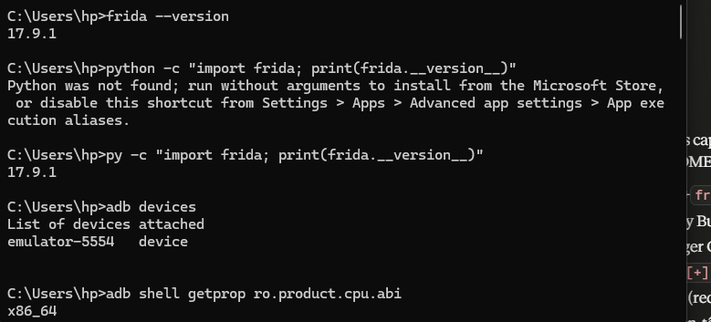
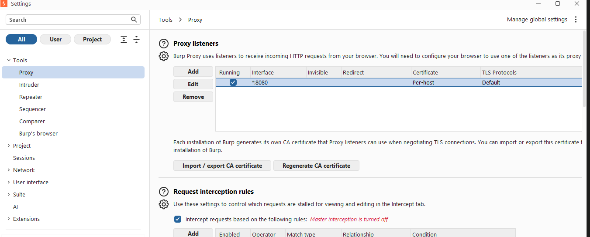
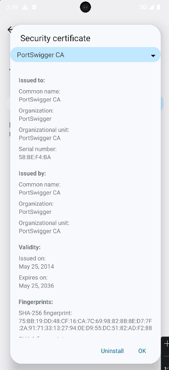
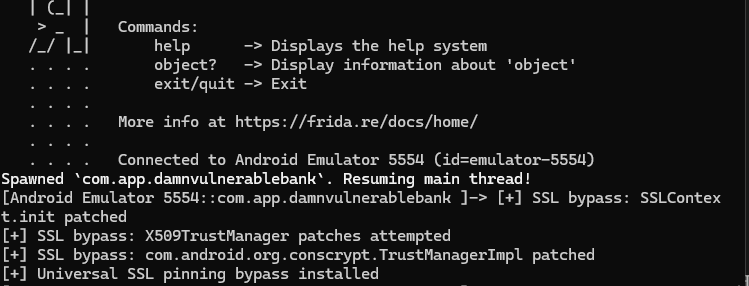
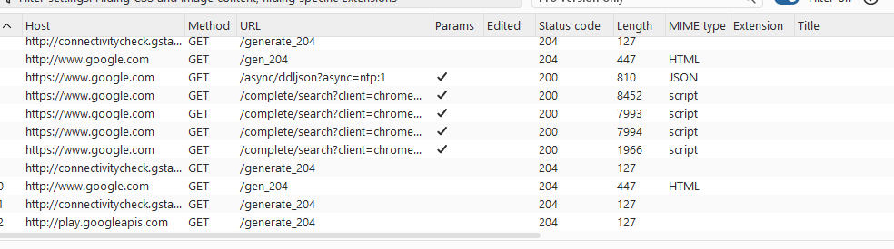
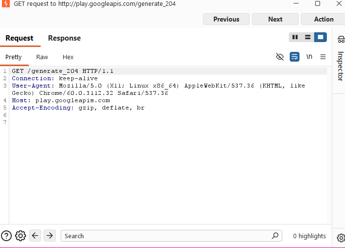

# LAB 15 — Analyse Dynamique Android : Inspection TLS/HTTPS et Gestion du SSL Pinning

**Cours :** Sécurité des applications mobiles  
**Établissement :** ENSA MARRAKECH 
**Réalisé par :FATIMAEZZAHRA ENNASSIRI

---

## ⚠️ Avertissement éthique

> Ces techniques sont utilisées **uniquement dans un cadre légal et pédagogique** (formation, audit autorisé, applications de test). Le contournement du SSL pinning vise l'inspection du trafic à des fins de sécurité. Ces méthodes ne doivent jamais être déployées en production ni utilisées sur des applications sans autorisation explicite.

---

## Objectifs

- Installer et vérifier Frida côté PC et `frida-server` sur un émulateur Android.
- Mettre en place un proxy TLS (Burp Suite) et installer le certificat CA sur l'appareil.
- Neutraliser le SSL pinning via hooks Java (TrustManager / Conscrypt / OkHttp / WebView).
- Valider le bypass en capturant le trafic HTTPS déchiffré dans Burp Suite.

---

## Environnement utilisé

| Composant | Détail |
|---|---|
| OS | Windows 10 (PowerShell) |
| Frida (PC) | 17.9.1 |
| frida-server | 17.9.1 (android-x86_64) |
| Émulateur | Android Studio AVD — `emulator-5554` |
| Architecture CPU | x86_64 |
| Proxy TLS | Burp Suite Community |
| Application cible | Chrome (`com.android.chrome`) / DamnVulnerableBank |

---

## Étape 1 — Vérification de l'environnement

### 1.1 Version Frida et ADB

```powershell
frida --version
py -c "import frida; print(frida.__version__)"
adb devices
adb shell getprop ro.product.cpu.abi
```

**Résultat obtenu :**



- ✅ Frida **17.9.1** détecté
- ✅ Émulateur **emulator-5554** connecté en mode `device`
- ✅ Architecture CPU : **x86_64**

---

### 1.2 Déploiement de frida-server

Le binaire `frida-server-17.9.1-android-x86_64` a été téléchargé depuis [github.com/frida/frida/releases](https://github.com/frida/frida/releases) puis déployé :

```powershell
adb push frida-server /data/local/tmp/
adb shell chmod 755 /data/local/tmp/frida-server
adb shell "/data/local/tmp/frida-server &"
```

Vérification que frida-server est actif :

```powershell
frida-ps -Uai
```

> Le message `Address already in use` à la relance confirme que `frida-server` tournait déjà en arrière-plan — comportement normal.

---

## Étape 2 — Configuration du proxy Burp Suite

### 2.1 Listener Burp

Burp Suite a été configuré avec un listener sur toutes les interfaces (`0.0.0.0:8080`) pour accepter les connexions provenant de l'émulateur AVD.



- ✅ Interface : `*:8080` (toutes interfaces)
- ✅ Statut : **Running**

### 2.2 Redirection du trafic réseau

```powershell
# Redirection ADB
adb reverse tcp:8080 tcp:8080

# Configuration système du proxy sur l'émulateur
adb shell settings put global http_proxy 10.0.2.2:8080
```

> L'adresse `10.0.2.2` est l'adresse spéciale de l'hôte PC vue depuis un émulateur AVD.

---

## Étape 3 — Installation du certificat CA Burp

### 3.1 Export du certificat

Dans Burp Suite : **Proxy Settings → Import/Export CA Certificate → Export Certificate in DER format** → sauvegardé sous `burp.der`.

### 3.2 Transfert et installation

```powershell
# Push du certificat sur l'émulateur
adb push C:\Users\hp\AppData\Local\Programs\BurpSuite\burp.der /sdcard/burp.der
adb shell cp /sdcard/burp.der /sdcard/Download/burp.der

# Ouverture de l'installateur de certificat
adb shell am start -a android.intent.action.VIEW \
    -d file:///sdcard/burp.der \
    -t application/x-x509-ca-cert
```

Sur l'émulateur : **Paramètres → Sécurité → Chiffrement et identifiants → Installer un certificat → Certificat CA**

**Certificat installé avec succès :**



- ✅ **PortSwigger CA** installé
- ✅ Valide jusqu'au **25 mai 2036**
- ✅ Empreinte SHA-256 vérifiée

---

## Étape 4 — Script de bypass SSL Pinning universel

### 4.1 Contenu du script `sslpin_bypass_universal.js`

Le script couvre les vecteurs suivants :

| # | Cible | Méthode |
|---|---|---|
| 1 | `SSLContext.init` | Injection d'un TrustManager permissif |
| 2 | `X509TrustManager` | Patch de `checkServerTrusted` / `checkClientTrusted` |
| 3 | Conscrypt `TrustManagerImpl` | Neutralisation de `checkTrusted` / `verifyChain` |
| 4 | OkHttp `CertificatePinner` | Bypass de `check()` |
| 5 | WebView | Acceptation des erreurs SSL via `onReceivedSslError` |

```javascript
// sslpin_bypass_universal.js
Java.perform(function(){
  const ArrayList = Java.use('java.util.ArrayList');
  function ok(tag){ console.log('[+] SSL bypass:', tag); }

  // 1) SSLContext.init — injecter un TrustManager permissif si aucun n'est fourni
  try{
    const SSLContext = Java.use('javax.net.ssl.SSLContext');
    SSLContext.init.overload(
      '[Ljavax.net.ssl.KeyManager;',
      '[Ljavax.net.ssl.TrustManager;',
      'java.security.SecureRandom'
    ).implementation = function(km, tm, sr){
      let useTm = tm;
      try {
        if (!tm || tm.length === 0){
          const X509TM = Java.registerClass({
            name: 'com.frida.FriendlyTM',
            implements: [Java.use('javax.net.ssl.X509TrustManager')],
            methods: {
              checkClientTrusted: function(chain, authType){},
              checkServerTrusted: function(chain, authType){},
              getAcceptedIssuers: function(){
                return Java.array('java.security.cert.X509Certificate', []);
              }
            }
          });
          const TMArr = Java.use('[Ljavax.net.ssl.TrustManager;');
          const arr = TMArr.$new(1);
          arr[0] = X509TM.$new();
          useTm = arr;
          ok('Injected permissive TrustManager');
        }
      } catch(e){}
      return this.init(km, useTm, sr);
    };
    ok('SSLContext.init patched');
  }catch(e){ console.log('[-] SSLContext.init patch failed:', e.message); }

  // 2) Patch large des implémentations X509TrustManager
  try{
    Java.enumerateLoadedClasses({
      onMatch: function(name){
        const low = name.toLowerCase();
        if (low.includes('trust') || low.includes('pin')){
          try{
            const K = Java.use(name);
            ['checkServerTrusted','checkClientTrusted'].forEach(m => {
              if (K[m]) K[m].overloads.forEach(ov => {
                ov.implementation = function(){
                  ok(name+'.'+m+' -> allow');
                  return null;
                };
              });
            });
          }catch(_){}
        }
      },
      onComplete: function(){ ok('X509TrustManager patches attempted'); }
    });
  }catch(e){ console.log('[-] enumerateLoadedClasses failed:', e.message); }

  // 3) Conscrypt TrustManagerImpl (Android 7+)
  ['com.android.org.conscrypt.TrustManagerImpl',
   'org.conscrypt.TrustManagerImpl'].forEach(cls => {
    try{
      const TMI = Java.use(cls);
      ['checkTrusted','verifyChain','checkServerTrusted'].forEach(m => {
        if (TMI[m]) TMI[m].overloads.forEach(ov => {
          ov.implementation = function(){
            ok(cls+'.'+m+' -> allow');
            try { return ov.apply(this, arguments); }
            catch(e){ try { return ArrayList.$new(); } catch(_){ return null; } }
          };
        });
      });
      ok(cls+' patched');
    }catch(e){}
  });

  // 4) OkHttp 3/4 CertificatePinner
  try{
    const CP = Java.use('okhttp3.CertificatePinner');
    if (CP.check) CP.check.overloads.forEach(ov => {
      ov.implementation = function(){
        ok('okhttp3.CertificatePinner.check skip');
        return;
      };
    });
  }catch(e){}

  // 5) WebView: ignorer les erreurs SSL
  try{
    const WVC = Java.use('android.webkit.WebViewClient');
    if (WVC.onReceivedSslError)
      WVC.onReceivedSslError.implementation = function(view, handler, error){
        ok('WebView onReceivedSslError -> proceed');
        handler.proceed();
      };
  }catch(e){}

  console.log('[+] Universal SSL pinning bypass installed');
});
```

---

## Étape 5 — Exécution du bypass

### 5.1 Lancement via Frida (mode spawn)

```powershell
frida -U -f com.android.chrome -l C:\Users\hp\Desktop\sslpin_bypass_universal.js
```

### 5.2 Résultat console Frida



```
Spawned `com.app.damnvulnerablebank`. Resuming main thread!
[+] SSL bypass: SSLContext.init patched
[+] SSL bypass: X509TrustManager patches attempted
[+] SSL bypass: com.android.org.conscrypt.TrustManagerImpl patched
[+] Universal SSL pinning bypass installed
```

- ✅ `SSLContext.init` patché avec succès
- ✅ `X509TrustManager` neutralisé
- ✅ `TrustManagerImpl` (Conscrypt) patché
- ✅ Bypass universel installé

---

## Étape 6 — Validation : Capture du trafic HTTPS

### 6.1 Trafic intercepté dans Burp — HTTP History



Les requêtes HTTPS de l'application sont désormais visibles en clair dans Burp Suite :

| Host | Méthode | URL | Status |
|---|---|---|---|
| `https://www.google.com` | GET | `/async/ddljson?async=ntp:1` | 200 |
| `https://www.google.com` | GET | `/complete/search?client=chrome...` | 200 |
| `http://play.googleapis.com` | GET | `/generate_204` | 204 |

### 6.2 Détail d'une requête interceptée



```http
GET /generate_204 HTTP/1.1
Connection: keep-alive
User-Agent: Mozilla/5.0 (X11; Linux x86_64) AppleWebKit/537.36
            (KHTML, like Gecko) Chrome/60.0.3112.32 Safari/537.36
Host: play.googleapis.com
Accept-Encoding: gzip, deflate, br
```

- ✅ En-têtes HTTP visibles en clair
- ✅ `User-Agent`, `Host`, `Accept-Encoding` interceptés
- ✅ Le proxy MITM fonctionne correctement

---

## Résumé des résultats

| Étape | Statut | Détail |
|---|---|---|
| Installation Frida 17.9.1 | ✅ | PC + frida-server x86_64 |
| Détection émulateur AVD | ✅ | emulator-5554 |
| Configuration Burp Suite | ✅ | Listener 0.0.0.0:8080 |
| Installation certificat CA | ✅ | PortSwigger CA — valide 2036 |
| SSL Pinning bypass | ✅ | SSLContext + Conscrypt patchés |
| Capture trafic HTTPS | ✅ | Requêtes en clair dans Burp |

---

## Bonnes pratiques appliquées

- Hooks limités au strict nécessaire pour réduire les effets de bord.
- Aucune donnée sensible réelle n'a été exposée (applications de test uniquement).
- Le certificat CA et le proxy ont été configurés dans un environnement isolé (émulateur).
- `frida-server` désactivé et CA à retirer après les tests pour restaurer un état sûr.

---

## Outils et références

| Outil | Version | Lien |
|---|---|---|
| Frida | 17.9.1 | https://frida.re |
| ADB Platform Tools | — | https://developer.android.com/tools |
| Burp Suite Community | — | https://portswigger.net/burp |
| Android Studio AVD | — | https://developer.android.com/studio |
| DamnVulnerableBank | — | Application de test OWASP |

---

*LAB 15 — Sécurité des applications mobiles | ENSA Marrakech | 2026*
